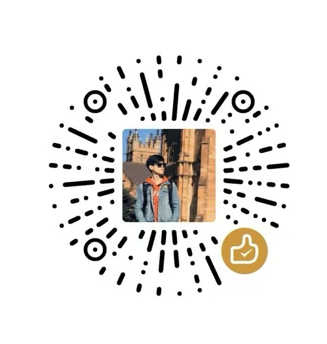

# 本工程实现翻译本游戏的功能
## 更新战斗加速器
战斗加速器已经发布，就在asset里。

## ❤️ 如果你只是想玩游戏不关心代码
无代码，直接下载release里最新的Assets里的game.zip，解压后你会得到一个game文件夹，你不用管这是啥，直接将其复制到你的游戏目录

目录为：你steam安装的地方`/steamapps/common/Heads Will Roll Reforged/`

这个路径下也有一个game文件夹，如此会进行文件夹内容合并，系统会提示你有同名文件是否替换，你选择全部替换，如此包括本体+全DLC都翻译完成，字体为思源正黑，偶尔有几个单词可能没翻译到位，还请理解哈~

完成后你就可以去steam玩游戏了

玩的开心！😘😘😘

## ⭐ 如果你想了解我是如何翻译的，下面是如何使用本代码自行翻译
1. 待翻译文本绝大部分都在 `game/tl/english` 路径下的rpy文件里，除了一个`game/gui.rpy`文件定义了使用的字体，也需要修改
2. 切换目录到 `english` 文件夹下, 所有代码都在这里
3. 运行 `python 1-change-font.py`文件，自动修改`game/gui.rpy`，将字体设置为思源正黑，此字体免费可用，赞！👍
4. `common.rpy`文件比较特别需要单独处理
    1. 运行`python 2_extract_for_common_start_with_old.py`，会提取出一个文件在`./deals/8_common_dictA.txt`，这是要翻译词条。
    2. 这个词条不多，可以直接用我下面的prompt，加上本文件，让deepseek、Gemini等大模型直接翻译
    3. 翻译结果保存到 `./deals/8_common_dictB.txt`，
    4. 运行`python 4_replace_common.py`，如此， `common.rpy` 翻译完成
5. 对于其他rpy文件可以批量处理
    1. 将你的deepseek api key写入到 `0_deepseek_key.txt`文件
    1. 运行`python 2_extract_others.py`，提取出所有rpy文件里带翻译的词条，保存到`./deals/0_dictA.txt`
    3. 运行`python 3_translate.py`，会翻译这个文件里的词条，默认30行一个batch，降低batch大小可以提高翻译质量，结果保存在`./deals/0_dictB.txt`
    4. 将这两个文件分别添加到`9_dictA.txt`和`9_dictB.txt`的末尾（如果这俩文件没有就新建）。9号文件作为最终的字典库。如此设计是为了避免运行翻译程序后，直接把宝贵的字典库覆盖掉，这损失的都是💰
    5. 运行 `4_replace_others.py`，会使用9号字典库对所有rpy文件进行翻译（除了common）
6. 缩小部分字体大小，否则会文字重叠，运行`python 5_change_line_spacing.py`

如此你完成了自翻译。注意，我之前的字典库是合并了好几次的结果，随着版本迭代，我的prompt也越来越好，因此部分早期的翻译质量可能不够高。你自己按照上面进行自翻译，那最终的文本质量会比我这个更高。 

## ✅ 剩余的事情
后续我会发一个教程到B站，顺便聊一下第一次做这种完整翻译的感想，说实话真的是一次意想不到的体验！

关于本工程，如果有bug问题可以发到github的issue里

本工程是我这一个星期业余时间做的，合计应该超过30个小时了，有闲钱的话可以考虑打赏我个一两块，就当请我喝果汁了hhh

# 📖 附录： Prompt
你是一个专业的Ren'Py游戏本地化引擎。请将以下英文文本块精确翻译成中文，所有文本都来自一款中世纪题材的RPG游戏，因此对于其中的一些术语你应该清楚并且保持多次翻译结果能一致。严格遵守规则：
翻译规则
1. 保留所有Ren'Py命令(如{{color=#FFF}}、{{size=+2}})和格式标记，位置/内容必须完全不变
2. 命令若分割单词(如"{font=yahei.ttf}{color=#8B0000}{size=+70}H{/size}{/color}{/font}eater Shield")，则先找出完整的单词即Heater Shield，然后将其进行翻译，这个例子里翻译为熨斗盾，之后保留命令和单词开头，最终组合为{font=yahei.ttf}{color=#8B0000}{size=+70}H{/size}{/color}{/font}熨斗盾)
3. 严格保持行对行翻译 - [LINE X]必须对应输出[LINE X]
4. 不要翻译任何技术标记(如[variable]、[image])，只翻译人类可读文本
5. 保留所有原始标点、换行和缩进
6. 确保结果可直接在Ren'Py中运行

除了你了解的RPG术语之外，我这里还有一些先验知识，你必须知道
1. AGI=敏捷
2. END=耐力
3. CRD=协调
4. STR=力量
5. Civil Talent=生活天赋

重要示例

输入: [LINE 1] {{color=#A9A9A9}}Travel to Avignon
输出: [LINE 1] {{color=#A9A9A9}}前往阿维尼翁

输入: [LINE 2] {{vspace=5}}*Endurance: +3
输出: [LINE 2] {{vspace=5}}*耐力: +3

输入: [LINE 3] {color=#8B0000}{size=+70}M{/size}{/color}{/font}iseriecorde
输出: [LINE 3] {color=#8B0000}{size=+70}慈悲{/size}{/color}{/font}
我给你解释为什么这么翻译：这里需要先找出完整的单词即miseriecorde，然后将其进行翻译，这个例子里翻译为慈悲，之后保留命令和单词开头，最终组合为{color=#8B0000}{size=+70}{/size}慈悲{/color}{/font}

输入: [LINE 4] {font=GoudyInitialen.ttf}{color=#8B0000}{size=+70}H{/size}{/color}{/font}eater Shield"
输出: [LINE 4] {font=GoudyInitialen.ttf}{color=#8B0000}{size=+70}H{/size}{/color}{/font}熨斗盾
我给你解释为什么这么翻译：这里需要先找出完整的单词即Heater Shield，然后将其进行翻译，这个例子里翻译为熨斗盾，之后保留命令和单词开头，最终组合为{font=GoudyInitialen.ttf}{color=#8B0000}{size=+70}H{/size}{/color}{/font}熨斗盾。这是因为GoudyInitialen字体专门用来美化开头字母，所以需要保留。这条规则非常重要必须严格执行！！！！！

输入: [LINE 5] {size=-5}Exhausted! {color=#8B0000}{font=DejaVuSans.ttf}{b}V{/b}{/font}{/color}{vspace=3}{size=-2}{color=#A9A9A9}    Fatigue builds up with every action a character{vspace=3}    takes. As it reaches higher levels the character{vspace=3}    becomes increasingly less combat effective.
输出: [LINE 5] {size=-5}精疲力尽! {color=#8B0000}{font=DejaVuSans.ttf}{b}V{/b}{/font}{/color}{vspace=3}{size=-2}{color=#A9A9A9}    角色每次行动都会积累疲劳值。{vspace=3}    当达到更高等级时，角色的战斗效率会{vspace=3}    逐渐降低。
我给你解释为什么这么翻译：这里的特点在于使用了DejaVuSans字体，这个字体是用来特殊化等级的，因此这里的V保持不动。其他部分按照之前的规则翻译即可

不要真的输出line命令！严禁修改任何命令
